# **LR6**

## Лабораторная работа №6
## Система контроля версий

**Цель лабораторной работы:**
изучение базовых возможностей системы управления версиями, опыт работы с Git Api, опыт работы с локальным и удаленным репозиторием.

## Ход работы
1. Аккаунт GitHub уже был создан, ссылка: https://github.com/FugiOG.
2. Была сделана копия репозитория https://github.com/Kurtyanik/LR6/ в личное хранилище (fork).
    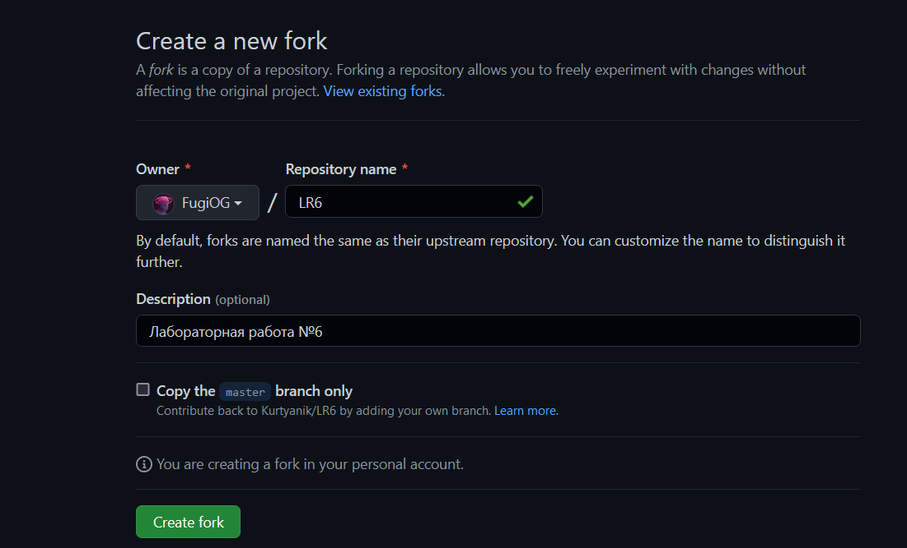
    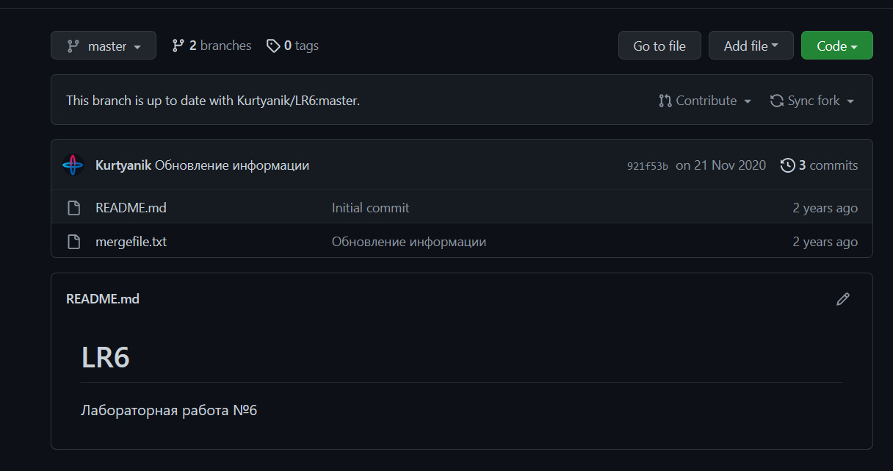
3. Git уже был установлен.

    ```console
    git --version
    ```
   
    Версия git:
    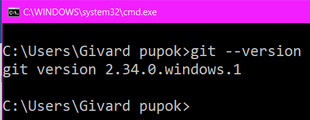
4. Был настроен клиент git *(было введено имя пользователя и email)*.
    ```console
    git config --global user.name "4118 Горожанкин А.А."
    git config --global user.email "rememberov.andrei@yandex.ru"
    ```
    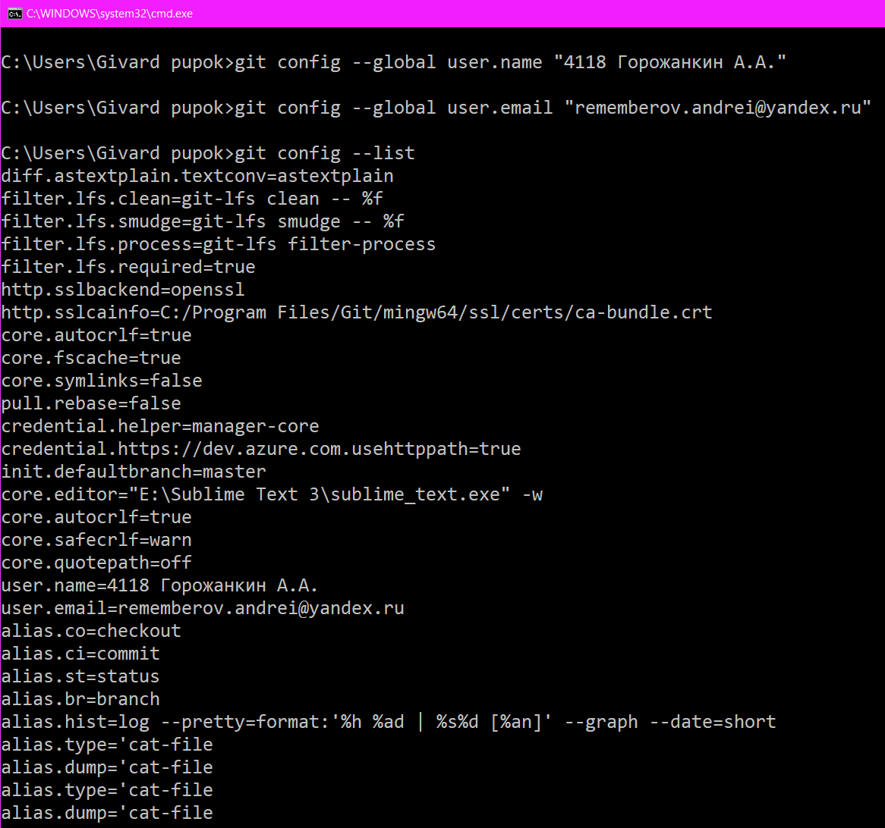
5. Личный удалённый репозиторий был склонирован на компьютер.
    ```console
    git clone https://github.com/FugiOG/LR6.git
    ```
    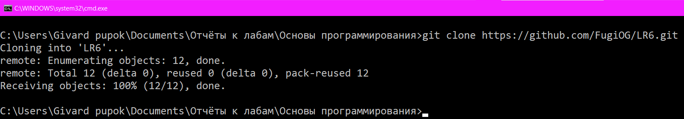
6. Был добавлен новый файл в репозиторий через интерфейс GitHub, затем изменения были подтянуты в локальный репозиторий.
    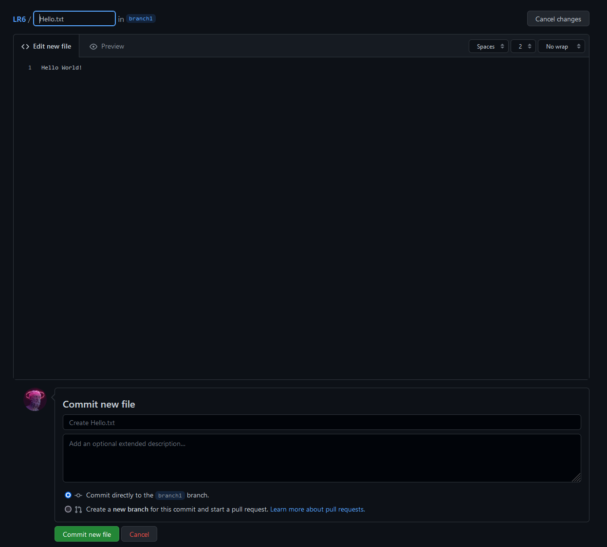
    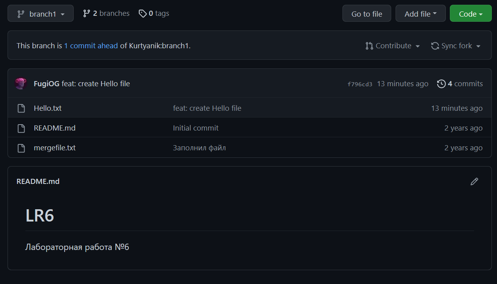
    ```console
    git branch
    git pull
    ```
    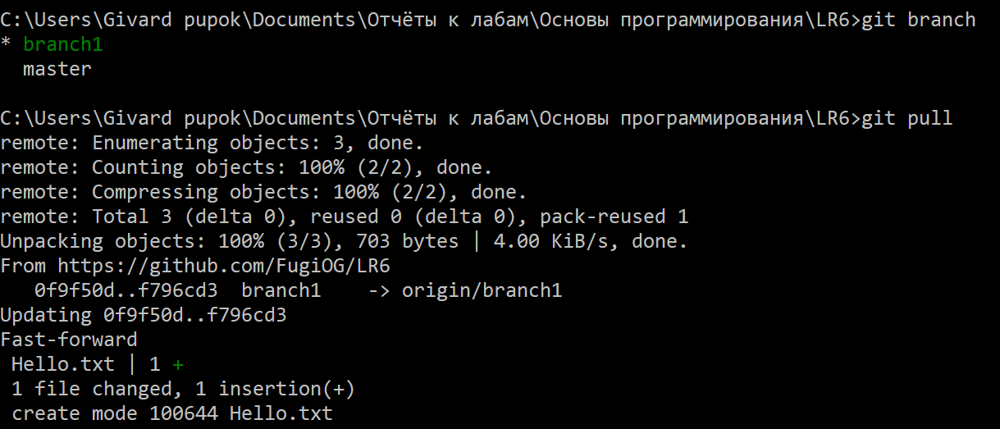
7. Была получена история операций для каждой из веток.
    ```console
    git log
    ```
    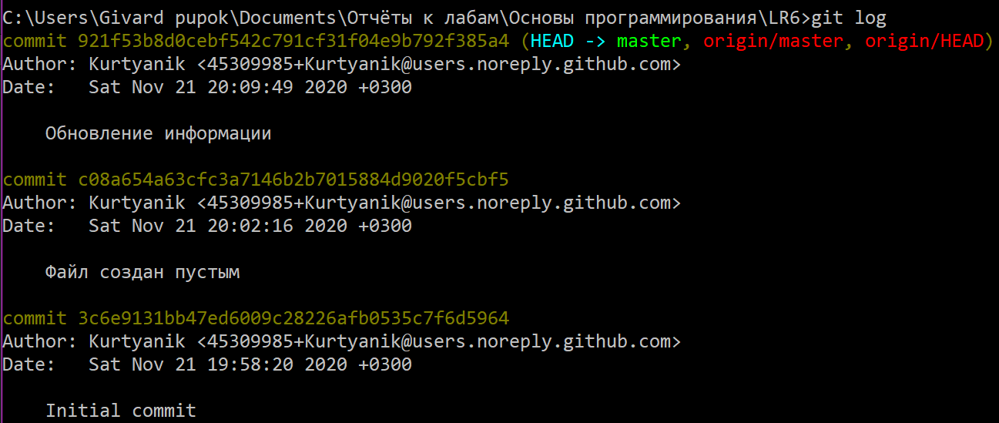
    ```console
    git checkout branch1
    git log
    ```
    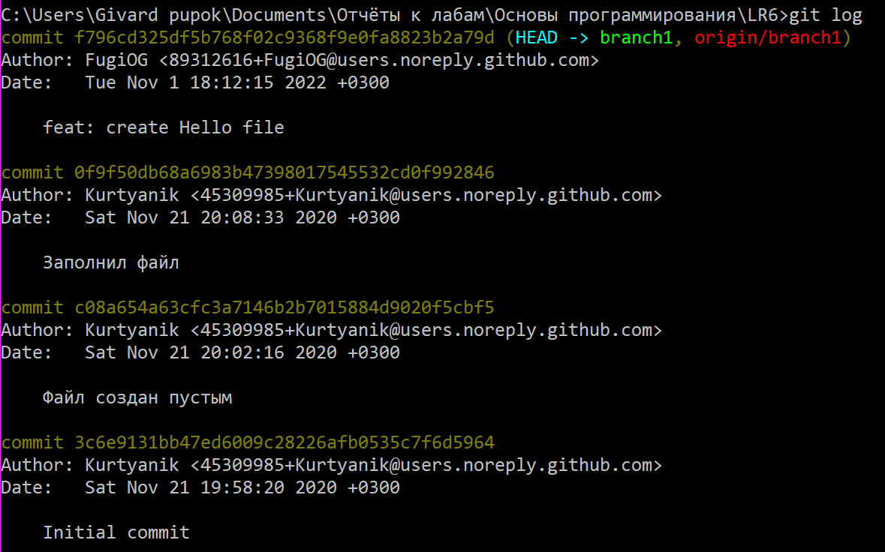
8. Были просмотрены последние изменения.
    ```console
    git status
    ```
    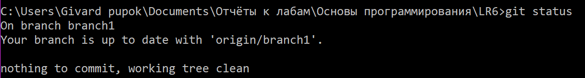
9. Было выполнено слияние в ветку master с разрешением конфликтов при помощи графического интерфейса.
    ```console
    git branch
    git merge branch1
    ```
    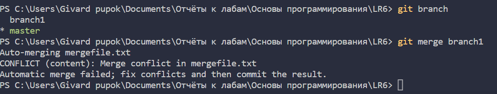
    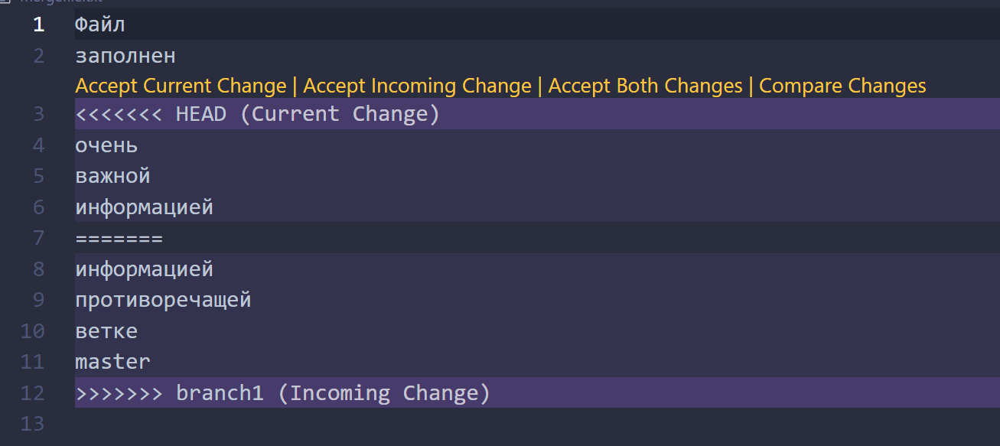
    ```console
    git status
    ```
    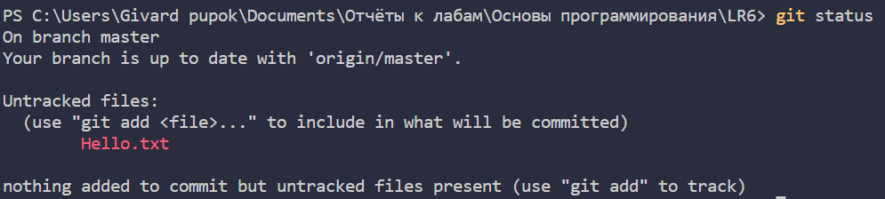